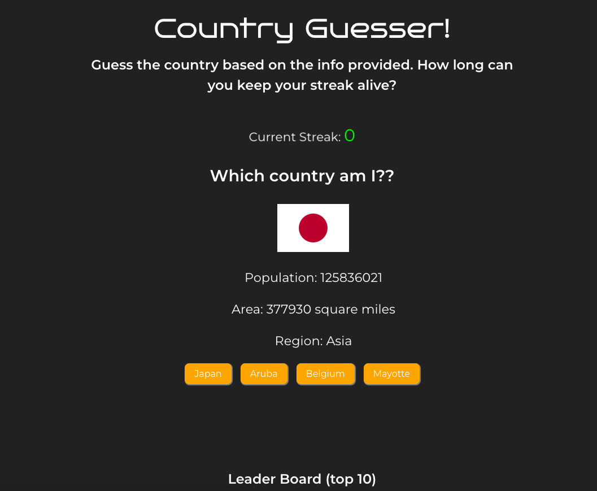

# Country Guesser

Country Guesser is a fun and educational guessing game built with React (via Vite) and powered by the REST Countries API. Test your knowledge of countries and their regions while having a blast!

<strike>Please note that the REST Countries API is expected to shut down in May 2023, so the functionality of this game may be affected after that date.</strike> As of September 2023, it appears that REST Countries API is still operational.

## Features

- **Engaging Gameplay**: Country Guesser is not just a game; it's an experience! It's designed to be enjoyable and educational, making it perfect for players of all ages.

- **Middle School Approved**: During development, this game was tested and loved by middle school students. They even maintained a leaderboard to see who could achieve the highest streak! Their valuable feedback and suggestions directly influenced the game's features.

- **Interactive Hints**: The game offers hints to help you make an informed guess. Based on user feedback, hints include a country flag for the correct country and other region-related information.

- **Visual Feedback**: Users wanted a clear indicator of whether their guess was correct or not. In response, we've added a color change in the background to make it unmistakable when you've guessed correctly.

- **Continuous Improvements**: The game's development was a collaborative effort with its enthusiastic users. Their daily input and suggestions made it an incredibly enjoyable project to work on.

Enjoy playing and learning with Country Guesser!

## Try It Out

You can play the game [here](https://kristofer11.github.io/country-guesser).

## Feedback and Contributions

If you have any feedback, suggestions, or would like to contribute to this project, feel free to reach out. 